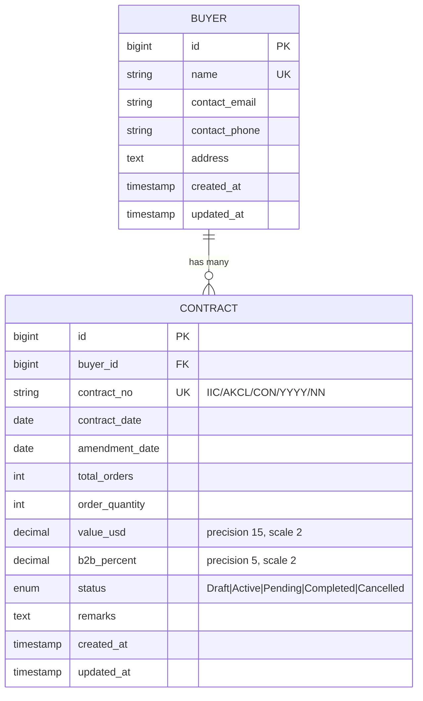
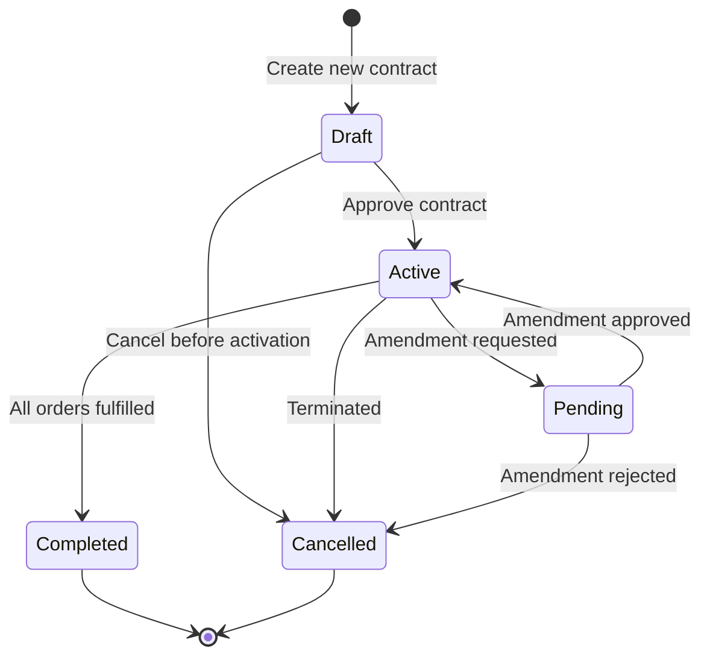

# Data Model: Sales Contract Management UI

**Feature**: 001-contract-management-ui  
**Created**: 2025-12-04  
**Purpose**: Define entities, relationships, validation rules, and state transitions for contract management system

## Entity Relationship Diagram



## Entity Definitions

### Buyer Entity

**Purpose**: Represents a company or individual purchasing entity that can have multiple sales contracts.

**Fields**:

| Field           | Type            | Constraints                                   | Description                   |
| --------------- | --------------- | --------------------------------------------- | ----------------------------- |
| `id`            | BIGINT UNSIGNED | PRIMARY KEY, AUTO_INCREMENT                   | Unique identifier             |
| `name`          | VARCHAR(255)    | NOT NULL, UNIQUE                              | Buyer company/individual name |
| `contact_email` | VARCHAR(255)    | NULLABLE, EMAIL FORMAT                        | Primary contact email         |
| `contact_phone` | VARCHAR(50)     | NULLABLE                                      | Primary contact phone number  |
| `address`       | TEXT            | NULLABLE                                      | Full address                  |
| `created_at`    | TIMESTAMP       | NOT NULL, DEFAULT CURRENT_TIMESTAMP           | Record creation timestamp     |
| `updated_at`    | TIMESTAMP       | NOT NULL, DEFAULT CURRENT_TIMESTAMP ON UPDATE | Last modification timestamp   |

**Relationships**:

- **Has Many** Contracts (one buyer can have multiple contracts)

**Validation Rules**:

- `name`: Required, unique across all buyers, max 255 characters
- `contact_email`: Optional, must be valid email format if provided
- `contact_phone`: Optional, recommended format validation (E.164 or custom)
- `address`: Optional, freeform text

**Indexes**:

- PRIMARY KEY on `id`
- UNIQUE INDEX on `name`
- INDEX on `contact_email` (for search functionality)

---

### Contract Entity

**Purpose**: Represents a sales contract with auto-generated contract number, associated buyer, order details, and status tracking.

**Fields**:

| Field            | Type            | Constraints                                   | Description                            |
| ---------------- | --------------- | --------------------------------------------- | -------------------------------------- |
| `id`             | BIGINT UNSIGNED | PRIMARY KEY, AUTO_INCREMENT                   | Unique identifier                      |
| `buyer_id`       | BIGINT UNSIGNED | FOREIGN KEY → buyers.id, NOT NULL             | Reference to buyer                     |
| `contract_no`    | VARCHAR(50)     | NOT NULL, UNIQUE, REGEX                       | Format: IIC/AKCL/CON/YYYY/NN           |
| `contract_date`  | DATE            | NOT NULL                                      | Contract signing date                  |
| `amendment_date` | DATE            | NOT NULL                                      | Last amendment date (>= contract_date) |
| `total_orders`   | INT UNSIGNED    | NOT NULL, >= 0                                | Total number of orders in contract     |
| `order_quantity` | INT UNSIGNED    | NOT NULL, >= 0                                | Aggregate order quantity               |
| `value_usd`      | DECIMAL(15,2)   | NOT NULL, >= 0                                | Total contract value in USD            |
| `b2b_percent`    | DECIMAL(5,2)    | NOT NULL, CHECK (0 <= b2b_percent <= 100)     | B2B percentage (0-100)                 |
| `status`         | ENUM            | NOT NULL, DEFAULT 'Draft'                     | Contract status                        |
| `remarks`        | TEXT            | NULLABLE                                      | Additional notes/comments              |
| `created_at`     | TIMESTAMP       | NOT NULL, DEFAULT CURRENT_TIMESTAMP           | Record creation timestamp              |
| `updated_at`     | TIMESTAMP       | NOT NULL, DEFAULT CURRENT_TIMESTAMP ON UPDATE | Last modification timestamp            |

**Relationships**:

- **Belongs To** Buyer (each contract belongs to one buyer)

**Validation Rules**:

1. **Contract Number** (`contract_no`):

   - **Format**: `IIC/AKCL/CON/YYYY/NN`
   - **Regex**: `^IIC\/AKCL\/CON\/\d{4}\/\d{2}$`
   - **Required**: YES
   - **Unique**: YES (database-enforced)
   - **Auto-generated**: Backend queries highest NN for year and increments
   - **Manual edit**: Allowed but must pass regex validation

2. **Buyer Reference** (`buyer_id`):

   - **Required**: YES
   - **Foreign Key**: Must exist in `buyers.id`
   - **On Delete**: RESTRICT (prevent deleting buyer with contracts)

3. **Dates**:

   - `contract_date`: Required, valid date
   - `amendment_date`: Required, valid date, must be >= `contract_date`

4. **Numeric Fields**:

   - `total_orders`: Required, integer >= 0
   - `order_quantity`: Required, integer >= 0
   - `value_usd`: Required, decimal with 2 decimal places, >= 0
   - `b2b_percent`: Required, decimal with 2 decimal places, range 0-100 (inclusive)

5. **Status** (`status`):

   - **Required**: YES
   - **Allowed Values**: Draft, Active, Pending, Completed, Cancelled
   - **Default**: Draft

6. **Remarks** (`remarks`):
   - **Optional**: YES
   - **Type**: Freeform text

**Indexes**:

- PRIMARY KEY on `id`
- UNIQUE INDEX on `contract_no`
- FOREIGN KEY INDEX on `buyer_id` (references buyers.id)
- INDEX on `status` (for filtering)
- INDEX on `contract_date` (for sorting/reporting)
- COMPOSITE INDEX on `contract_no` substring for year-based queries (optimization for next-number generation)

**Constraints**:

- CHECK constraint: `b2b_percent >= 0 AND b2b_percent <= 100`
- CHECK constraint: `amendment_date >= contract_date`
- FOREIGN KEY: `buyer_id` REFERENCES `buyers(id)` ON DELETE RESTRICT ON UPDATE CASCADE
- UNIQUE: `contract_no`

---

## State Transitions

### Contract Status State Machine



**State Descriptions**:

1. **Draft** (Initial State)

   - Contract created but not yet approved
   - All fields editable
   - Can transition to: Active, Cancelled

2. **Active**

   - Contract approved and in effect
   - Orders can be processed
   - Can transition to: Pending, Completed, Cancelled

3. **Pending**

   - Amendment or change requested
   - Awaiting approval
   - Can transition to: Active, Cancelled

4. **Completed**

   - All orders fulfilled
   - Contract closed successfully
   - Terminal state (no further transitions)

5. **Cancelled**
   - Contract terminated
   - No further processing
   - Terminal state (no further transitions)

**Transition Rules**:

- New contracts always start in **Draft** state
- Only **Draft** contracts can be directly activated
- **Active** contracts can be amended (→ Pending) or completed
- **Pending** contracts can be reactivated or cancelled
- **Completed** and **Cancelled** are terminal states (no transitions allowed)

---

## Database Schema (SQL)

### Buyers Table

```sql
CREATE TABLE buyers (
    id BIGINT UNSIGNED AUTO_INCREMENT PRIMARY KEY,
    name VARCHAR(255) NOT NULL UNIQUE,
    contact_email VARCHAR(255) NULL,
    contact_phone VARCHAR(50) NULL,
    address TEXT NULL,
    created_at TIMESTAMP NOT NULL DEFAULT CURRENT_TIMESTAMP,
    updated_at TIMESTAMP NOT NULL DEFAULT CURRENT_TIMESTAMP ON UPDATE CURRENT_TIMESTAMP,

    INDEX idx_contact_email (contact_email)
) ENGINE=InnoDB DEFAULT CHARSET=utf8mb4 COLLATE=utf8mb4_unicode_ci;
```

### Contracts Table

```sql
CREATE TABLE contracts (
    id BIGINT UNSIGNED AUTO_INCREMENT PRIMARY KEY,
    buyer_id BIGINT UNSIGNED NOT NULL,
    contract_no VARCHAR(50) NOT NULL UNIQUE,
    contract_date DATE NOT NULL,
    amendment_date DATE NOT NULL,
    total_orders INT UNSIGNED NOT NULL,
    order_quantity INT UNSIGNED NOT NULL,
    value_usd DECIMAL(15, 2) NOT NULL CHECK (value_usd >= 0),
    b2b_percent DECIMAL(5, 2) NOT NULL CHECK (b2b_percent >= 0 AND b2b_percent <= 100),
    status ENUM('Draft', 'Active', 'Pending', 'Completed', 'Cancelled') NOT NULL DEFAULT 'Draft',
    remarks TEXT NULL,
    created_at TIMESTAMP NOT NULL DEFAULT CURRENT_TIMESTAMP,
    updated_at TIMESTAMP NOT NULL DEFAULT CURRENT_TIMESTAMP ON UPDATE CURRENT_TIMESTAMP,

    CONSTRAINT fk_buyer FOREIGN KEY (buyer_id) REFERENCES buyers(id) ON DELETE RESTRICT ON UPDATE CASCADE,
    CONSTRAINT chk_amendment_date CHECK (amendment_date >= contract_date),

    INDEX idx_buyer_id (buyer_id),
    INDEX idx_status (status),
    INDEX idx_contract_date (contract_date),
    INDEX idx_contract_no_year (contract_no(20))
) ENGINE=InnoDB DEFAULT CHARSET=utf8mb4 COLLATE=utf8mb4_unicode_ci;
```

---

## Laravel Eloquent Models

### Buyer Model

```php
<?php

namespace App\Models;

use Illuminate\Database\Eloquent\Factories\HasFactory;
use Illuminate\Database\Eloquent\Model;
use Illuminate\Database\Eloquent\Relations\HasMany;

class Buyer extends Model
{
    use HasFactory;

    protected $fillable = [
        'name',
        'contact_email',
        'contact_phone',
        'address',
    ];

    protected $casts = [
        'created_at' => 'datetime',
        'updated_at' => 'datetime',
    ];

    /**
     * Get all contracts for this buyer.
     */
    public function contracts(): HasMany
    {
        return $this->hasMany(Contract::class);
    }
}
```

### Contract Model

```php
<?php

namespace App\Models;

use Illuminate\Database\Eloquent\Factories\HasFactory;
use Illuminate\Database\Eloquent\Model;
use Illuminate\Database\Eloquent\Relations\BelongsTo;

class Contract extends Model
{
    use HasFactory;

    protected $fillable = [
        'buyer_id',
        'contract_no',
        'contract_date',
        'amendment_date',
        'total_orders',
        'order_quantity',
        'value_usd',
        'b2b_percent',
        'status',
        'remarks',
    ];

    protected $casts = [
        'contract_date' => 'date',
        'amendment_date' => 'date',
        'total_orders' => 'integer',
        'order_quantity' => 'integer',
        'value_usd' => 'decimal:2',
        'b2b_percent' => 'decimal:2',
        'created_at' => 'datetime',
        'updated_at' => 'datetime',
    ];

    /**
     * Get the buyer that owns this contract.
     */
    public function buyer(): BelongsTo
    {
        return $this->belongsTo(Buyer::class);
    }

    /**
     * Validate contract number format.
     */
    public static function isValidContractNumber(string $contractNo): bool
    {
        return preg_match('/^IIC\/AKCL\/CON\/\d{4}\/\d{2}$/', $contractNo) === 1;
    }

    /**
     * Extract year from contract number.
     */
    public static function extractYear(string $contractNo): ?int
    {
        if (preg_match('/^IIC\/AKCL\/CON\/(\d{4})\/\d{2}$/', $contractNo, $matches)) {
            return (int) $matches[1];
        }
        return null;
    }

    /**
     * Extract running number from contract number.
     */
    public static function extractRunningNumber(string $contractNo): ?int
    {
        if (preg_match('/^IIC\/AKCL\/CON\/\d{4}\/(\d{2})$/', $contractNo, $matches)) {
            return (int) $matches[1];
        }
        return null;
    }
}
```

---

## Data Integrity Rules

1. **Referential Integrity**:

   - All contracts MUST reference a valid buyer (`buyer_id` foreign key)
   - Deleting a buyer with contracts is RESTRICTED (must delete or reassign contracts first)
   - Updating buyer ID cascades to contracts

2. **Uniqueness**:

   - Buyer names MUST be unique
   - Contract numbers MUST be unique across all contracts

3. **Data Validation**:

   - Contract numbers MUST match regex pattern
   - Amendment date MUST be >= contract date
   - B2B percentage MUST be 0-100 inclusive
   - All numeric values MUST be non-negative

4. **Status Transitions**:
   - Follow state machine rules (see State Transitions section)
   - Application layer SHOULD enforce valid transitions
   - Database does not enforce state transitions (application responsibility)

---

## Summary

This data model provides:

- ✅ Two entities with clear relationships (Buyer 1:N Contract)
- ✅ Strict validation rules matching functional requirements
- ✅ Contract number format enforcement at multiple layers
- ✅ State machine for contract lifecycle management
- ✅ Database constraints for data integrity
- ✅ Ready-to-use Laravel Eloquent models with helper methods
- ✅ Indexes optimized for query performance (search, filter, next-number generation)

All constraints and validations align with constitutional principles (Contract Number Format Enforcement, Full-Stack Validation) and functional requirements from the specification.
